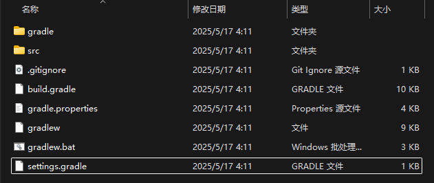

# McJty 的 Mod 入门教程 1.20 - EP1

::: info
原文地址：[https://www.mcjty.eu/docs/1.20/ep1](https://www.mcjty.eu/docs/1.20/ep1)

原作者：[McJty](https://www.mcjty.eu/)

翻译：[Kyoku](/pages/about)
:::

::: tip
这系列的教程翻译并不是完全逐行按原文翻译的，实际上是我在学习过程中按照自己的理解进行的转写以及补充。

你可以从这里的超链接快速跳到后续的章节：
:::

## 链接

- [Youtube 视频](https://youtu.be/BpUbD0NXfp8)
- [GitHub 仓库](https://github.com/McJty/Tut4_1Basics)

## 介绍

这篇教程主要包含基础的项目设置、Mod 入口类以及如何向游戏添加第一个方块。

如果你对这里的代码有任何疑问，或者发现代码不完整，你可以随时参考 GitHub 上的完整代码。

## 基础项目设置

::: info 译者注：

比较老生常谈的问题是 Forge 官网在国内不是连不上就是慢的要命，如果网络环境不佳可以使用国内的 MDK 镜像：[IMU Mirror](https://mirrors.imucraft.cn/forge/1.20.1/47.4.0/forge-1.20.1-47.4.0-mdk.zip)

:::

要开始编写你自己的 Mod， 最简单的方式就是从 [Forge 官网下载站](https://adfoc.us/serve/sitelinks/?id=271228&url=https://maven.minecraftforge.net/net/minecraftforge/forge/1.20.1-47.4.0/forge-1.20.1-47.4.0-mdk.zip) 下载最新的 **ForgeMDK**，然后将它解压到一个临时文件夹。

然后为你的 Mod 创建一个新的目录，并从 MDK 中复制以下文件：

- `gradle` 文件夹
- `src` 文件夹
- `gradlew.bat` 和 `gradlew`
- `settings.gradle`, `build.gradle`, 以及 `gradle.properties`
- `.gitignore`



现在你可以用你的 IDE（在这篇教程里都以 **IntelliJ IDEA** 作为示例） 来将 `build.gradle` 作为一个 Java 项目打开了，不过在这之前要记得在电脑上安装 JDK17 及以上版本的 JDK（Java Development Kit）。

::: info 译者注：

推荐使用 Microsoft Build of OpenJDK，你可以在 [这里](https://aka.ms/download-jdk/microsoft-jdk-17.0.15-windows-x64.msi) 下载。

:::

现在你可能想要修改你的 Mod 的 `modid`，一个只由 小写字母、数字以及下划线 组成的标识符。

你需要在以下两个地方进行修改：

- `gradle.properties`
- Mod 主类，在这个 MDK 里面叫做 `ExampleMod`，你可以把它改成更合适的名字。同时，你可能也需要重命名包名。

::: info 译者注：

Java 有一套通行的标准命名模式，包名通常使用公司或组织的域名倒序作为前缀，例如 `com.example`。

如果你有一个自己的域名，比如我的`machinedog.wang`，那么我的包名就是`wang.machinedog`，我的主类应该是`./src/main/java/wang/machinedog/ExampleMod.java`。

至于主类入口文件的命名一般没有什么要求，遵守大驼峰命名法即可，我建议使用你的 Mod 的全名来命名主类，比如我的 Mod 叫做`Endless Dunes`，入口文件就可以叫`EndlessDunes.java`

:::

## `gradle.properties`

从 Forge MDK 1.20 开始，项目的配置都可以且推荐在 `gradle.properties`文件中进行。`build.gradle` 中有特殊的任务来确保这些值能够正确地传到 `mods.toml` 和其他地方。

## 映射表

Minecraft 的游戏文件在分发之前进行了混淆。这意味着所有的方法、字段和变量的名称都被替换成了无意义的字符串。ForgeGradle 可以帮你对这些文件进行反混淆，但它需要知道应该使用哪种映射表。

对于现在的 Minecraft 版本，基本上有两种流行的映射表：

- **official**：来自 Mojang 的官方映射表
- **parchment**：带有额外的参数和文档的官方映射表

你可以在 [这里](https://parchmentmc.org/docs/getting-started) 找到关于 Parchment 映射表的更多信息。

## JEI & TOP 依赖配置

在开发的时候能用 JEI(Just Enough Items) 和 TOP(The One Probe) 会减少很多麻烦，为了实现这样的功能，你需要在 `build.gradle` 里修改`repositories`字段的内容。

<Heimu>什么你问我为什么会提到 TOP 这个 Mod？你要不查一下 TOP 是谁写的（笑</Heimu>

```groovy title="build.gradle"
repositories {
    // Put repositories for dependencies here
    // ForgeGradle automatically adds the Forge maven and Maven Central for you

    maven { // 添加 JEI 的 Maven 仓库
        url "https://maven.blamejared.com"
    }
    maven { // 添加 TOP 的 Maven 仓库
        url "https://maven.k-4u.nl"
    }
}
```

然后将 `dependencies` 字段修改成这样，主要添加了下面的 JEI 和 TOP 引入的部分:

```groovy title="build.gradle"
dependencies {
    // Specify the version of Minecraft to use. If this is any group other than 'net.minecraft', it is assumed
    // that the dep is a ForgeGradle 'patcher' dependency, and its patches will be applied.
    // The userdev artifact is a special name and will get all sorts of transformations applied to it.
    // 限定使用的 Minecraft 版本
    minecraft "net.minecraftforge:forge:${minecraft_version}-${forge_version}"

    // Example mod dependency with JEI - using fg.deobf() ensures the dependency is remapped to your development mappings
    // The JEI API is declared for compile time use, while the full JEI artifact is used at runtime
    // 作为示例的Mod依赖是JEI，通过使用 fg.deobf() 可以确保依赖被重映射到你开发时选用的映射表上
    // JEI 的 API 被声明为只在编译时使用，而完整的 JEI 则会在运行时使用
    compileOnly fg.deobf("mezz.jei:jei-${minecraft_version}-common-api:${jei_version}")
    compileOnly fg.deobf("mezz.jei:jei-${minecraft_version}-forge-api:${jei_version}")
    runtimeOnly fg.deobf("mezz.jei:jei-${minecraft_version}-forge:${jei_version}")

    // 通过 implementation 声明的依赖表示这个依赖在编译时和运行时都需要，且：
    // 在编译时会被使用、在运行时会被包含、不会暴露给依赖于这个 Mod 的其他 Mod
    // 通过 project.dependencies.create 创建依赖对象而不是直接传入依赖名称字符串是可选的，这是一种更灵活的依赖配置方式
    // 但是实际上和 implementation fg.deobf("mcjty.theoneprobe:theoneprobe:${top_version}") 效果是一样的

    implementation fg.deobf(project.dependencies.create("mcjty.theoneprobe:theoneprobe:${top_version}") {
            transitive = false // 禁用传递依赖，即不自动引入 The One Probe 自身所依赖的其他库
    })
}
```

不要忘记修改 `gradle.properties`，在其中任意一个你喜欢的地方添加`jei_version`和`top_version`这两个变量。

```groovy title="gradle.properties"
jei_version=15.20.0.106
top_version=1.20.1-10.0.1-3
```

千万千万不要忘记哦！不然你是拉不下来依赖的（笑

把这些活都干完之后，我们就可以刷新并同步 Gradle 依赖了，你可以在 Idea 中点击右上角的大象图标来刷新 Gradle 项目。


::: info 译者注：

原教程文档中这部分直接缺失了依赖版本相关的问题，补充一下，我们从 maven 仓库拉取依赖的时候需要指定我们具体要拉什么依赖，通过`包名`:`项目名`: `版本号`来指定，例如`mezz.jei:jei-1.20.1-common-api:15.20.0.106`，其中：

- `mezz.jei` 是包名
- `jei-1.20.1-common-api` 是项目名
- `15.20.0.106` 是版本号

你可能有发现，有时候其中有一部分值会被使用很多很多很多很多次，比如这里的`1.20.1`，这时候我们就可以使用变量来简化配置，通过使用`${变量名}`来引用`gradle.properties`中定义的变量，这种格式化替换的方法之后还会经常使用。

:::

::: tip 发散一下

:::

## 生成运行配置

To be able to run Minecraft from within IntelliJ you can also need to run the 'genIntellijRuns' task (also in the gradle tab).
This will generate 'runClient', 'runServer', and 'runData' targets. For now, we'll use 'runClient' mostly.
Try it out and if all went well you should see Minecraft If this was successful you should see something like this:

:::danger Warning
Make sure that you're using Java 17!
:::

image

## The Basic Mod Class

There are many ways to structure your mod.
In this base tutorial we follow the structure from the MDK. In future tutorials we will restructure this a bit.
So here is our main mod class:

```java title="Tutorial1Basics.java"
// The value here should match an entry in the META-INF/mods.toml file
@Mod(Tutorial1Basics.MODID)
public class Tutorial1Basics {
    // Define mod id in a common place for everything to reference
    public static final String MODID = "tut1basics";
    // Directly reference a slf4j logger
    private static final Logger LOGGER = LogUtils.getLogger();

    // Create a Deferred Register to hold Blocks which will all be registered under the "tut1basics" namespace
    public static final DeferredRegister<Block> BLOCKS = DeferredRegister.create(ForgeRegistries.BLOCKS, MODID);
    // Create a Deferred Register to hold Items which will all be registered under the "tut1basics" namespace
    public static final DeferredRegister<Item> ITEMS = DeferredRegister.create(ForgeRegistries.ITEMS, MODID);

    // Creates a new Block with the id "tut1basics:example_block", combining the namespace and path
    public static final RegistryObject<Block> EXAMPLE_BLOCK = BLOCKS.register("example_block", () -> new Block(BlockBehaviour.Properties.of().mapColor(MapColor.STONE)));
    // Creates a new BlockItem with the id "tut1basics:example_block", combining the namespace and path
    public static final RegistryObject<Item> EXAMPLE_BLOCK_ITEM = ITEMS.register("example_block", () -> new BlockItem(EXAMPLE_BLOCK.get(), new Item.Properties()));

    public Tutorial1Basics() {
        IEventBus modEventBus = FMLJavaModLoadingContext.get().getModEventBus();

        // Register the commonSetup method for modloading
        modEventBus.addListener(this::commonSetup);

        // Register the Deferred Registers to the mod event bus so blocks and items get registered
        BLOCKS.register(modEventBus);
        ITEMS.register(modEventBus);

        // Register ourselves for server and other game events we are interested in
        MinecraftForge.EVENT_BUS.register(this);

        // Register the item to a creative tab
        modEventBus.addListener(this::addCreative);
    }

    private void commonSetup(final FMLCommonSetupEvent event) {
        // Some common setup code
        LOGGER.info("HELLO FROM COMMON SETUP");
        LOGGER.info("DIRT BLOCK >> {}", ForgeRegistries.BLOCKS.getKey(Blocks.DIRT));
    }

    private void addCreative(BuildCreativeModeTabContentsEvent event) {
        if (event.getTabKey() == CreativeModeTabs.BUILDING_BLOCKS) {
            event.accept(EXAMPLE_BLOCK_ITEM);
        }
    }

    // You can use SubscribeEvent and let the Event Bus discover methods to call
    @SubscribeEvent
    public void onServerStarting(ServerStartingEvent event) {
        // Do something when the server starts
        LOGGER.info("HELLO from server starting");
    }

    // You can use EventBusSubscriber to automatically register all static methods in the class annotated with @SubscribeEvent
    @Mod.EventBusSubscriber(modid = MODID, bus = Mod.EventBusSubscriber.Bus.MOD, value = Dist.CLIENT)
    public static class ClientModEvents {
        @SubscribeEvent
        public static void onClientSetup(FMLClientSetupEvent event) {
            // Some client setup code
            LOGGER.info("HELLO FROM CLIENT SETUP");
            LOGGER.info("MINECRAFT NAME >> {}", Minecraft.getInstance().getUser().getName());
        }
    }
}
```

## Minecraft Concepts

In the following image there are three columns:

- `Definitions`: these are objects of which there is only one instance in the game. There is (for example) only one diamond sword. If you have two diamond swords in your inventory they are two different '''ItemStack''' instances referring to the same diamond sword item instance. This is important!
- `Inventory`: all objects in an inventory (player or other containers) are represented with ItemStacks. An ItemStack is an actual in-game instance of an item. Note: in order to be able to hold blocks in your inventory the block needs a corresponding item
- `World`: when blocks are placed in the world they are placed as a `BlockState`. A BlockState is a specific configuration of a block. For example, a furnace can have six orientations. Those are six different blockstates. In addition, a furnace can also be powered or not. So that means in total 12 different blockstates. '''Block Entities''' are objects that help extend blocks in the world to be able to hold more information (like inventory) as well as do things (tick).

image

## Sides

**Forge documentation**: https://docs.minecraftforge.net/en/1.20.x/concepts/sides/

Minecraft runs on two sides: the client and the server. The client is the side that the
player sees and interacts with. The server is the side that runs the game logic. Note that
even in single player there is a server. This we call the integrated server.
Read the forge documentation linked above for more detailed information. Note that this is
a very important thing to understand well.

## Events

**Forge documentation**: https://docs.minecraftforge.net/en/1.20.x/concepts/events/

Events are a very important concept in Forge. They are used to hook into the Minecraft game
at various points. There are two main categories of events:

- `Mod` events: these are events that are fired on the `Mod` event bus. This bus is used for listening to lifecycle events in which mods should initialize
- `Forge` events: these are events that are fired on the `Forge` event bus. This bus is used for listening to events that happen in the game

Some examples of events are:

- `FMLCommonSetupEvent`: this event is fired when the game is starting up. This is the place where you want to do most of your setup
- `FMLClientSetupEvent`: this event is fired when the client is starting up. This is the place where you want to do client-side setup
- `BuildCreativeModeTabContentsEvent`: this event is fired when the creative mode tabs are being built. This is the place where you want to add your items to the creative tabs

The events above are all fired on the `Mod` event bus. There are also events on the `Forge` event bus:

- `ServerStartingEvent`: this event is fired when the server is starting. This is the place where you want to do server-side setup
- `EntityJoinLevelEvent`: this event is fired when an entity is joining a world
- `BlockEvent.BreakEvent`: this event is fired when a block is being broken

But there are many more events. You can find them in your IDE by looking at the `net.minecraftforge.event` package.

:::info Tip!
Events that implement `IModEventBus` are fired on the `Mod` event bus.
:::

A popular image that is often posted on the Forge Discord is this one. Very often people have trouble
with their events. Often the problem is that their method is static or not static when it should be the other way around.

Events

## Registration and Timing

**Forge documentation**: https://docs.minecraftforge.net/en/1.20.x/concepts/registries/

Forge follows very specific timing rules for when you have to do certain things during mod
setup. You can't just register stuff at any time that you want. For every kind of thing that
you register there is a specific time when you have to do that and this is controlled with events.

The _DeferredRegister_ is a very easy way to handle registration of various objects in the Minecraft game (blocks, items, containers, dimensions, entities, ...).
It's important to note that in this register we will always register singletons. i.e. the objects in the 'Definition' column of our previous image.
For every object that we want to add to our mod we declare a RegistryObject and then register it on the appropriate deferred register.
In that registration we also give a supplier (lambda) to actually generate the instance of our registry object at the appropriate time.

Note: objects are registered pretty early.
That means that at the time the FMLCommonSetupEvent is fired all objects from all mods will be registered and ready.

:::danger Warning!
Because registration of objects happens very early it happens before config is handled. That means that
you cannot depend on configuration values during registration! Don't register conditionally! If you must
use other ways to disable your content (like hide from JEI, disable recipes, ...)
:::

Note how we make a corresponding item (using BlockItem) for every block.
That's because we need to be able to hold these blocks in our inventory (in case someone does silk touch on them).

In this specific example we use the standard vanilla Block and Item classes.
Later we will show you how you can make your own custom blocks and items using subclasses.

## Data Generation

**Forge documentation**: https://docs.minecraftforge.net/en/1.20.x/concepts/lifecycle/#data-generation

If we run our mod now you will see that the blocks and items are not correctly textured and that the blocks don't have a good name.
To fix that we need to make models and a bunch of other JSON files.
We will be using data generation to generate those as that's the most flexible way to do things.
With only a small mod it may not seem very beneficial to do this but in the end it's a very nice technique and will help you avoid many errors caused by handwritten JSON files.
Data generation will be covered in the next episode.
