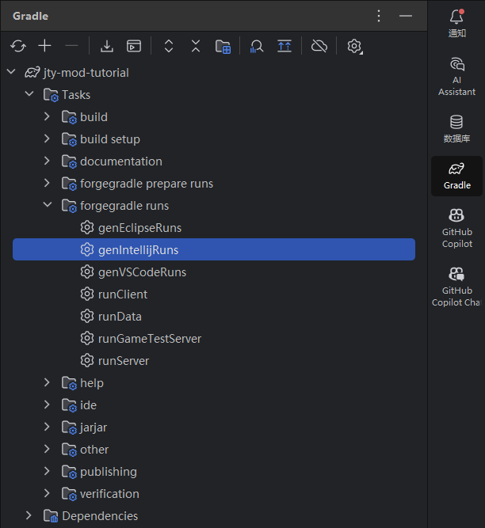
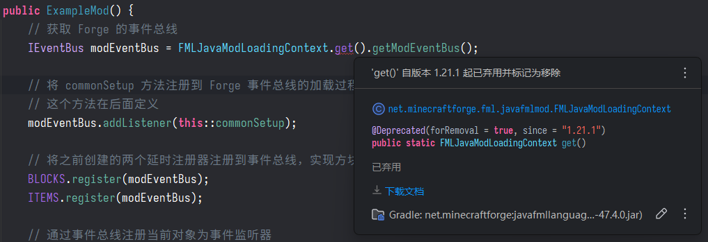
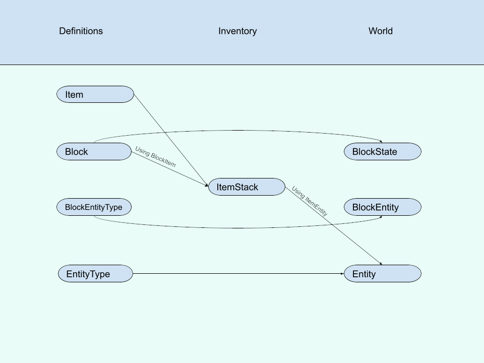

# McJty 的 Mod 入门教程 1.20 - EP1

::: info
原文地址：[https://www.mcjty.eu/docs/1.20/ep1](https://www.mcjty.eu/docs/1.20/ep1)

原作者：[McJty](https://www.mcjty.eu/)

翻译：[Kyoku](/pages/about)
:::

::: tip
这系列的教程翻译并不是完全逐行按原文翻译的，实际上是我在学习过程中按照自己的理解进行的转写以及补充。

你可以从这里的超链接快速跳到后续的章节：
:::

## 链接

- [Youtube 视频](https://youtu.be/BpUbD0NXfp8)
- [GitHub 仓库](https://github.com/McJty/Tut4_1Basics)

## 介绍

这篇教程主要包含基础的项目设置、Mod 入口类以及如何向游戏添加第一个方块。

如果你对这里的代码有任何疑问，或者发现代码不完整，你可以随时参考 GitHub 上的完整代码。

## 基础项目设置

::: info 译者注：

比较老生常谈的问题是 Forge 官网在国内不是连不上就是慢的要命，如果网络环境不佳可以使用国内的 MDK 镜像：[IMU Mirror](https://mirrors.imucraft.cn/forge/1.20.1/47.4.0/forge-1.20.1-47.4.0-mdk.zip)

:::

要开始编写你自己的 Mod， 最简单的方式就是从 [Forge 官网下载站](https://adfoc.us/serve/sitelinks/?id=271228&url=https://maven.minecraftforge.net/net/minecraftforge/forge/1.20.1-47.4.0/forge-1.20.1-47.4.0-mdk.zip) 下载最新的 **ForgeMDK**，然后将它解压到一个临时文件夹。

然后为你的 Mod 创建一个新的目录，并从 MDK 中复制以下文件：

- `gradle` 文件夹
- `src` 文件夹
- `gradlew.bat` 和 `gradlew`
- `settings.gradle`, `build.gradle`, 以及 `gradle.properties`
- `.gitignore`


现在你可以用你的 IDE（在这篇教程里都以 **IntelliJ IDEA** 作为示例） 来将 `build.gradle` 作为一个 Java 项目打开了，不过在这之前要记得在电脑上安装 JDK17 及以上版本的 JDK（Java Development Kit）。

::: info 译者注：

推荐使用 Microsoft Build of OpenJDK，你可以在 [这里](https://aka.ms/download-jdk/microsoft-jdk-17.0.15-windows-x64.msi) 下载。

:::

现在你可能想要修改你的 Mod 的 `modid`，一个只由 小写字母、数字以及下划线 组成的标识符。

你需要在以下两个地方进行修改：

- `gradle.properties`
- Mod 主类，在这个 MDK 里面叫做 `ExampleMod`，你可以把它改成更合适的名字。同时，你可能也需要重命名包名。

::: info 译者注：

Java 有一套通行的标准命名模式，包名通常使用公司或组织的域名倒序作为前缀，例如 `com.example`。

如果你有一个自己的域名，比如我的域名是 `machinedog.wang`，我给 Mod 分配的 `ModId`（命名空间）是 `examplemod`，那么我的包名就是`wang.machinedog.examplemod`，我的主类应该是`./src/main/java/wang/machinedog/examplemod/ExampleMod.java`。

至于主类入口文件的命名一般没有什么要求，遵守大驼峰命名法即可，我建议使用你的 Mod 的全名来命名主类，比如我的 Mod 叫做`Tutorial1 Basics`，入口文件就可以叫`Tutorial1Basics.java`

:::

## `gradle.properties`

从 Forge MDK 1.20 开始，项目的配置都可以且推荐在 `gradle.properties`文件中进行。`build.gradle` 中有特殊的任务来确保这些值能够正确地传到 `mods.toml` 和其他地方。

## 映射表

Minecraft 的游戏文件在分发之前进行了混淆。这意味着所有的方法、字段和变量的名称都被替换成了无意义的字符串。ForgeGradle 可以帮你对这些文件进行反混淆，但它需要知道应该使用哪种映射表。

对于现在的 Minecraft 版本，基本上有两种流行的映射表：

- **official**：来自 Mojang 的官方映射表
- **parchment**：带有额外的参数和文档的官方映射表

你可以在 [这里](https://parchmentmc.org/docs/getting-started) 找到关于 Parchment 映射表的更多信息。

## JEI & TOP 依赖配置

在开发的时候能用 JEI(Just Enough Items) 和 TOP(The One Probe) 会减少很多麻烦，为了实现这样的功能，你需要在 `build.gradle` 里修改`repositories`字段的内容。

<Heimu>什么你问我为什么会提到 TOP 这个 Mod？你要不查一下 TOP 是谁写的（笑</Heimu>

```groovy title="build.gradle"
repositories {
    // Put repositories for dependencies here
    // ForgeGradle automatically adds the Forge maven and Maven Central for you

    maven { // 添加 JEI 的 Maven 仓库
        url "https://maven.blamejared.com"
    }
    maven { // 添加 TOP 的 Maven 仓库
        url "https://maven.k-4u.nl"
    }
}
```

然后将 `dependencies` 字段修改成这样，主要添加了下面的 JEI 和 TOP 引入的部分:

```groovy title="build.gradle"
dependencies {
    // Specify the version of Minecraft to use. If this is any group other than 'net.minecraft', it is assumed
    // that the dep is a ForgeGradle 'patcher' dependency, and its patches will be applied.
    // The userdev artifact is a special name and will get all sorts of transformations applied to it.
    // 限定使用的 Minecraft 版本
    minecraft "net.minecraftforge:forge:${minecraft_version}-${forge_version}"

    // Example mod dependency with JEI - using fg.deobf() ensures the dependency is remapped to your development mappings
    // The JEI API is declared for compile time use, while the full JEI artifact is used at runtime
    // 作为示例的Mod依赖是JEI，通过使用 fg.deobf() 可以确保依赖被重映射到你开发时选用的映射表上
    // JEI 的 API 被声明为只在编译时使用，而完整的 JEI 则会在运行时使用
    compileOnly fg.deobf("mezz.jei:jei-${minecraft_version}-common-api:${jei_version}")
    compileOnly fg.deobf("mezz.jei:jei-${minecraft_version}-forge-api:${jei_version}")
    runtimeOnly fg.deobf("mezz.jei:jei-${minecraft_version}-forge:${jei_version}")

    // 通过 implementation 声明的依赖表示这个依赖在编译时和运行时都需要，且：
    // 在编译时会被使用、在运行时会被包含、不会暴露给依赖于这个 Mod 的其他 Mod
    // 通过 project.dependencies.create 创建依赖对象而不是直接传入依赖名称字符串是可选的，这是一种更灵活的依赖配置方式
    // 但是实际上和 implementation fg.deobf("mcjty.theoneprobe:theoneprobe:${top_version}") 效果是一样的

    implementation fg.deobf(project.dependencies.create("mcjty.theoneprobe:theoneprobe:${top_version}") {
            transitive = false // 禁用传递依赖，即不自动引入 The One Probe 自身所依赖的其他库
    })
}
```

不要忘记修改 `gradle.properties`，在其中任意一个你喜欢的地方添加`jei_version`和`top_version`这两个变量。

```groovy title="gradle.properties"
jei_version=15.20.0.106
top_version=1.20.1-10.0.1-3
```

千万千万不要忘记哦！不然你是拉不下来依赖的（笑

把这些活都干完之后，我们就可以刷新并同步 Gradle 依赖了，你可以在 Idea 中点击右上角的大象图标来刷新 Gradle 项目。


::: info 译者注：

原教程文档中这部分直接缺失了依赖版本相关的问题，补充一下，我们从 maven 仓库拉取依赖的时候需要指定我们具体要拉什么依赖，通过`包名`:`项目名`: `版本号`来指定，例如`mezz.jei:jei-1.20.1-common-api:15.20.0.106`，其中：

- `mezz.jei` 是包名
- `jei-1.20.1-common-api` 是项目名
- `15.20.0.106` 是版本号

你可能有发现，有时候其中有一部分值会被使用很多很多很多很多次，比如这里的`1.20.1`，这时候我们就可以使用变量来简化配置，通过使用`${变量名}`来引用`gradle.properties`中定义的变量，这种格式化替换的方法之后还会经常使用。

:::

::: details 💡 发散一下

虽然我们已经知道了要用`包名`:`项目名`: `版本号`的方式来从 Maven 仓库拉依赖，但是这里的三个值具体怎么填还是有些让人一团雾水。

这就是考验你从网上查东西的水平的时候了（笑

首先，绝大多数情况下，当你需要依赖某一个 mod 的时候，这个 mod 的可用的 `包名`:`项目名`:`版本号`都会在它的发布页或者文档里写出来。

其次，我们可以从 Maven 仓库去反过来找其中的内容，一般来讲大部分常见的 Maven 仓库是可以直接从浏览器访问并查看其中的目录树的，这样你就可以顺着你需要的 Mod 的包名和项目名去一步步的找到你具体需要拉取的依赖信息。

可是还有很多 Mod 甚至根本就没有通过自己的 Maven 仓库进行分发，而是仅发布到 CurseForge 或者 Modrinth 上，此时你可以通过使用 Curse Maven / Modrinth Maven 来拉取这些 Mod。

这两个 Maven 仓库分发服务的使用就后续再谈了，你可以直接自己尝试去查询用法，或者实在是这么懒的话也可以等我以后写个文档。
:::

## 生成运行配置

为了能够在 IntelliJ Idea 里运行 Minecraft 以方便调试，我们需要在 Gradle 选项卡中选择并运行 `genIntellijRuns` 任务。

这个任务会在运行成功之后生成`runClient`、`runServer` 和 `runData` 这几个任务。而我们主要会使用 `runClient` 来直接在 IDE 里运行游戏客户端。



::: warning

对于 1.20 及以上的版本（比如这篇教程中使用的 1.20.1），请务必使用 **Java 17** 或更高版本。

:::

::: tip

请在你每次更改过 gradle 相关的文件之后都运行一次`genIntellijRuns` 任务以确保运行配置是最新的。

:::

## Mod 的基础类

Well，在 Java 里你其实有很多很多种组织代码的方法，不过在这篇教程中，我们只需要跟随 MDK 的代码组织方式即可，在之后的教程中我们还会略微修改这套结构。

假设 Mod 的 `ModId` 是 `examplemod`，你可以参考下面的代码来修改 Mod 的基类：

```java title="Tutorial1Basics.java"
@Mod(ExampleMod.MODID)
public class ExampleMod {
    // 这里的ModId必须要和 META-INF/mods.toml 中填写的 ModId 相同
    // 当然也理应和 Gradle 配置中的 ModId 相同
    public static final String MODID = "examplemod";
    // 实例化一个slf4j logger，用来输出日志的（Forge标准日志框架）
    private static final Logger LOGGER = LogUtils.getLogger();

    // 创建一个延迟的注册器，用来在这个ModId的命名空间下注册方块
    public static final DeferredRegister<Block> BLOCKS = DeferredRegister.create(ForgeRegistries.BLOCKS, MODID);
    // 创建一个延迟的注册器，用来在这个ModId的命名空间下注册物品
    public static final DeferredRegister<Item> ITEMS = DeferredRegister.create(ForgeRegistries.ITEMS, MODID);

    // 创建一个方块 "examplemod:example_block"
    public static final RegistryObject<Block> EXAMPLE_BLOCK = BLOCKS.register("example_block", () -> new Block(BlockBehaviour.Properties.of().mapColor(MapColor.STONE)));
    // 创建这个方块对应的 方块物品
    public static final RegistryObject<Item> EXAMPLE_BLOCK_ITEM = ITEMS.register("example_block", () -> new BlockItem(EXAMPLE_BLOCK.get(), new Item.Properties()));

    // 注册同名入口构建方法，在 Java 中，这类构造方法的返回值就是这个类的实例，可以确保这个类只会被全局实例化一次
    public ExampleMod() {
        // 获取 Forge 的事件总线
        IEventBus modEventBus = FMLJavaModLoadingContext.get().getModEventBus();

        // 将 commonSetup 方法注册到 Forge 事件总线的加载过程中
        // 这个方法在后面定义
        modEventBus.addListener(this::commonSetup);

        // 将之前创建的两个延时注册器注册到事件总线，实现方块和物品的创建
        BLOCKS.register(modEventBus);
        ITEMS.register(modEventBus);

        // 通过事件总线注册当前实例为事件监听器
        MinecraftForge.EVENT_BUS.register(this);

        // 将注册的物品添加到创造模式物品栏中，同样这个方法后面也会有定义
        modEventBus.addListener(this::addCreative);
    }

    private void commonSetup(final FMLCommonSetupEvent event) {
        // 这个方法用于在 Mod 被加载的时候执行一些初始化操作
        LOGGER.info("HELLO FROM COMMON SETUP");
        LOGGER.info("DIRT BLOCK >> {}", ForgeRegistries.BLOCKS.getKey(Blocks.DIRT));
    }

    private void addCreative(BuildCreativeModeTabContentsEvent event) {
        // 这个方法用于在 创造模式物品栏 中添加物品
        if (event.getTabKey() == CreativeModeTabs.BUILDING_BLOCKS) {
            event.accept(EXAMPLE_BLOCK_ITEM);
        }
    }

    // 你还可以通过 @SubscribeEvent 来让事件总线发现并调用方法
    @SubscribeEvent
    public void onServerStarting(ServerStartingEvent event) {
        // 在游戏服务器启动时触发
        LOGGER.info("HELLO from server starting");
    }

    // 你可以通过 @EventBusSubscriber 来让事件总线自动注册所有被 @SubscribeEvent 注解的方法
    @Mod.EventBusSubscriber(modid = MODID, bus = Mod.EventBusSubscriber.Bus.MOD, value = Dist.CLIENT)
    public static class ClientModEvents {
        @SubscribeEvent
        public static void onClientSetup(FMLClientSetupEvent event) {
            // 在游戏客户端启动时触发
            LOGGER.info("HELLO FROM CLIENT SETUP");
            LOGGER.info("MINECRAFT NAME >> {}", Minecraft.getInstance().getUser().getName());
        }
    }
}
```

::: info 译者注

如果你使用了现代一点的版本的 Idea，你可能会发现一个错误提示：



这是因为 `FMLJavaModLoadingContext` 的`get()` 方法被标记为了 `@Deprecated`，也就是一个将在未来被弃用的方法。

如果你没有特别不想看见代码被标红的话，你可以选择忽略这个错误，游戏照跑不误。但是你也可以选择更换到新的编写方式。

```java
// 注册同名入口构建方法，在 Java 中，这类构造方法的返回值就是这个类的实例，可以确保这个类只会被全局实例化一次
public ExampleMod(FMLJavaModLoadingContext context) {
    // 获取 Forge 的事件总线
    IEventBus modEventBus = context.getModEventBus();

    // 将 commonSetup 方法注册到 Forge 事件总线的加载过程中
    // 这个方法在后面定义
    modEventBus.addListener(this::commonSetup);

    // 将之前创建的两个延时注册器注册到事件总线，实现方块和物品的创建
    BLOCKS.register(modEventBus);
    ITEMS.register(modEventBus);

    // 通过事件总线注册当前实例为事件监听器
    MinecraftForge.EVENT_BUS.register(this);

    // 将注册的物品添加到创造模式物品栏中，同样这个方法后面也会有定义
    modEventBus.addListener(this::addCreative);
}
```

新版本的 Forge 支持以这种被称之为 `依赖注入` 的方式来注册 Mod 的构造方法。

你问什么是依赖注入？简而言之，依赖注入就是一种创建实例的方式，实例本身不负责自己依赖的对象的创建和管理（比如各种传入的参数），而是由外部来创建并管理，通过传参的方式来注入到实例中。

:::

## 一些你应该知道的概念

在下面的图中有三列我们需要理解的概念：

- `定义`：这些对象在整个游戏运行周期中只有一个实例。例如，游戏中只有一个钻石剑的实例。如果你的背包中有两把钻石剑，那么它们实际上是两个不同的 `ItemStack` 实例，但都引用了同一个钻石剑 `Item` 实例。这一点非常重要！

- `物品栏`：一个玩家或容器中的所有对象都用 ItemStack（物品堆栈）表示。ItemStack 是游戏中实际物品的实例。注意：要能够将方块放入物品栏，方块必须对应于一个对应的 BlockItem。

- `世界`：当方块被放置在世界中时，它们以 BlockState（方块状态）存在。BlockState 是方块的特定配置。例如，熔炉可以有六种朝向，这就是六种不同的方块状态。此外，熔炉可以处于点燃或未点燃状态，所以总共有 12 种不同的方块状态。_Block Entities_（方块实体）是用于帮助扩展世界中方块功能的对象，使它们能够存储更多信息（如物品栏内容）并执行各种功能（如定时更新）。



## Sides

**Forge documentation**: https://docs.minecraftforge.net/en/1.20.x/concepts/sides/

Minecraft runs on two sides: the client and the server. The client is the side that the
player sees and interacts with. The server is the side that runs the game logic. Note that
even in single player there is a server. This we call the integrated server.
Read the forge documentation linked above for more detailed information. Note that this is
a very important thing to understand well.

## Events

**Forge documentation**: https://docs.minecraftforge.net/en/1.20.x/concepts/events/

Events are a very important concept in Forge. They are used to hook into the Minecraft game
at various points. There are two main categories of events:

- `Mod` events: these are events that are fired on the `Mod` event bus. This bus is used for listening to lifecycle events in which mods should initialize
- `Forge` events: these are events that are fired on the `Forge` event bus. This bus is used for listening to events that happen in the game

Some examples of events are:

- `FMLCommonSetupEvent`: this event is fired when the game is starting up. This is the place where you want to do most of your setup
- `FMLClientSetupEvent`: this event is fired when the client is starting up. This is the place where you want to do client-side setup
- `BuildCreativeModeTabContentsEvent`: this event is fired when the creative mode tabs are being built. This is the place where you want to add your items to the creative tabs

The events above are all fired on the `Mod` event bus. There are also events on the `Forge` event bus:

- `ServerStartingEvent`: this event is fired when the server is starting. This is the place where you want to do server-side setup
- `EntityJoinLevelEvent`: this event is fired when an entity is joining a world
- `BlockEvent.BreakEvent`: this event is fired when a block is being broken

But there are many more events. You can find them in your IDE by looking at the `net.minecraftforge.event` package.

:::info Tip!
Events that implement `IModEventBus` are fired on the `Mod` event bus.
:::

A popular image that is often posted on the Forge Discord is this one. Very often people have trouble
with their events. Often the problem is that their method is static or not static when it should be the other way around.

Events

## Registration and Timing

**Forge documentation**: https://docs.minecraftforge.net/en/1.20.x/concepts/registries/

Forge follows very specific timing rules for when you have to do certain things during mod
setup. You can't just register stuff at any time that you want. For every kind of thing that
you register there is a specific time when you have to do that and this is controlled with events.

The _DeferredRegister_ is a very easy way to handle registration of various objects in the Minecraft game (blocks, items, containers, dimensions, entities, ...).
It's important to note that in this register we will always register singletons. i.e. the objects in the 'Definition' column of our previous image.
For every object that we want to add to our mod we declare a RegistryObject and then register it on the appropriate deferred register.
In that registration we also give a supplier (lambda) to actually generate the instance of our registry object at the appropriate time.

Note: objects are registered pretty early.
That means that at the time the FMLCommonSetupEvent is fired all objects from all mods will be registered and ready.

:::danger Warning!
Because registration of objects happens very early it happens before config is handled. That means that
you cannot depend on configuration values during registration! Don't register conditionally! If you must
use other ways to disable your content (like hide from JEI, disable recipes, ...)
:::

Note how we make a corresponding item (using BlockItem) for every block.
That's because we need to be able to hold these blocks in our inventory (in case someone does silk touch on them).

In this specific example we use the standard vanilla Block and Item classes.
Later we will show you how you can make your own custom blocks and items using subclasses.

## Data Generation

**Forge documentation**: https://docs.minecraftforge.net/en/1.20.x/concepts/lifecycle/#data-generation

If we run our mod now you will see that the blocks and items are not correctly textured and that the blocks don't have a good name.
To fix that we need to make models and a bunch of other JSON files.
We will be using data generation to generate those as that's the most flexible way to do things.
With only a small mod it may not seem very beneficial to do this but in the end it's a very nice technique and will help you avoid many errors caused by handwritten JSON files.
Data generation will be covered in the next episode.
